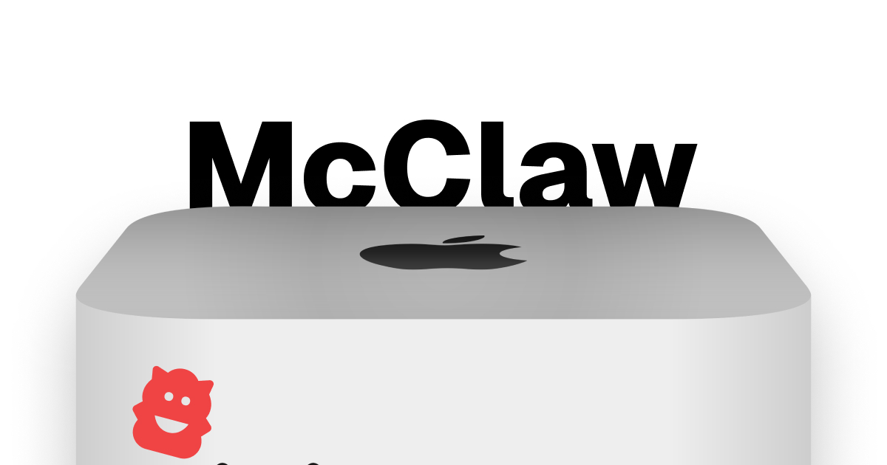
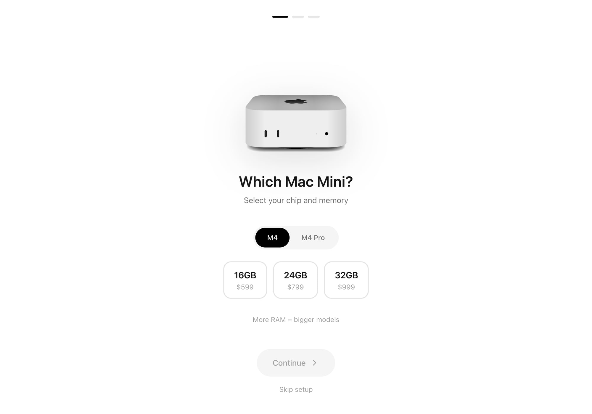
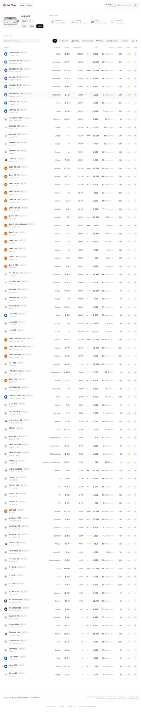

<p align="center">
  
</p>

<h1 align="center">McClaw</h1>

<p align="center">
  <strong>Find which local LLMs actually run on your Mac</strong>
</p>

<p align="center">
  <a href="https://mcclaw.it.com"></a>
  
  
  
</p>

<p align="center">
  <a href="https://mcclaw.it.com">Live Site</a> •
  <a href="https://blog.deeflect.com">Blog</a> •
  <a href="https://x.com/deeflectcom">Twitter</a>
</p>

---



## About

A tool that helps Mac users figure out which local LLMs can actually run on their hardware. You input your Mac Mini specs (chip and RAM) and get recommendations with performance estimates.

### The Problem

Running LLMs locally on Mac is confusing:
- "Will this 70B model fit in my 32GB RAM?"
- "What quantization should I use?"
- "Which model is best for coding vs general chat?"

Most people download something too big, it crashes, and they give up.

### The Solution

A simple 3-step wizard:
1. Select your Mac (M4/M4 Pro, RAM amount)
2. Select your experience level
3. See exactly which models fit your hardware



## Tech Stack

| Layer | Technology | Notes |
|-------|------------|-------|
| Frontend | React 18 + TypeScript | Stable, nothing fancy needed |
| Animations | Framer Motion | Smooth wizard transitions |
| Styling | Tailwind CSS 3 | Fast iteration |
| Backend | Convex | Only for cloud model price comparisons |
| Hosting | Vercel | Free tier handles everything |

### Why No Server?

The model database is static data compiled into the frontend. This means:
- Instant filtering with no API calls
- Works offline after first load
- Updates are just a redeploy

## Model Database

50+ models with multiple quantization variants. Some examples:

| Model | Parameters | q4_k_m RAM | Category |
|-------|------------|------------|----------|
| Qwen 2.5 Coder 14B | 14B | 10.5 GB | Coding |
| Llama 3.1 8B | 8B | 6.5 GB | General |
| DeepSeek R1 32B | 32B | 22 GB | Reasoning |
| LLaVA 7B | 7B | 6 GB | Vision |

Full model compatibility table available in [data/models.md](data/models.md)

### Device Configurations

```typescript
devices = {
  "m4-16":    { ram: 16, usableRam: 12 },  // ~4GB reserved for macOS
  "m4-24":    { ram: 24, usableRam: 18 },
  "m4-32":    { ram: 32, usableRam: 26 },
  "m4pro-48": { ram: 48, usableRam: 40 },
  "m4pro-64": { ram: 64, usableRam: 54 },
}
```

## How Matching Works

```typescript
// Filter models that fit in available RAM
models
  .flatMap(model => model.variants)
  .filter(variant => variant.ramGb <= device.usableRam)
  .sort(by benchmark scores, then by popularity)
```



## Design Notes

The UI is intentionally Apple-inspired:
- Centered content with minimal chrome
- Large, tappable buttons
- Progress indicators
- Clean typography

This feels familiar to Mac users and builds trust.

### Progressive Disclosure

Beginners see a curated "Top Picks" view with recommendations. Power users get the full table with all quantization options and benchmark scores.

## Quantization Reference

| Quantization | Quality | Size | Recommended Use |
|--------------|---------|------|-----------------|
| q4_k_m | ~95% | 50% | Default choice for most users |
| q8_0 | ~99% | 100% | When quality matters |
| fp16 | 100% | 200% | Benchmarking only |

## Ideas for Later

- MacBook support (currently Mac Mini only)
- User-submitted performance reports
- Direct Ollama integration to detect installed models

---

Built by [@deeflectcom](https://x.com/deeflectcom) for the [OpenClaw](https://openclaw.ai) community

Model data sourced from Ollama, official papers, Open LLM Leaderboard, and personal testing on M4 Mac Mini 32GB.
