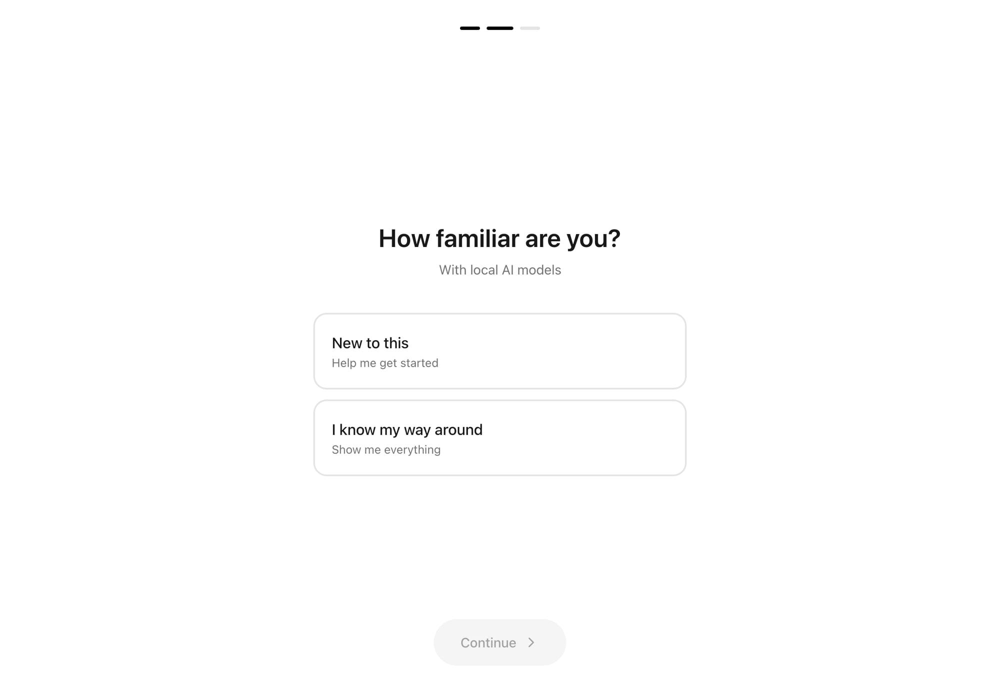

# 🦀 McClaw

> Find the right local LLM for your Mac hardware

**Live:** [mcclaw.it.com](https://mcclaw.it.com)


---

## Overview

**McClaw** helps Mac users discover which local LLMs can actually run on their hardware. Input your Mac Mini specs (chip + RAM) and get instant recommendations with performance estimates.

### The Problem

Running LLMs locally on Mac is confusing:
- "Will this 70B model fit in my 32GB RAM?"
- "What quantization should I use?"
- "Which model is best for coding vs. general chat?"

Most people either:
1. Download a model that's too big and crashes
2. Use a tiny model and wonder why it's dumb
3. Give up and pay for API calls

### The Solution

A simple wizard that:
1. Asks what Mac you have (M4/M4 Pro, how much RAM)
2. Asks your experience level (beginner vs. power user)
3. Shows exactly which models fit, with recommendations

No guessing. No trial and error.

---

## Screenshots

### Setup Wizard
Clean, Apple-inspired onboarding. Select your hardware in seconds.


### Experience Selection
Different UI for beginners (guided) vs. experts (show everything).



---

## Tech Stack

| Layer | Technology | Why |
|-------|------------|-----|
| **Frontend** | React 18 + TypeScript | Stable, well-tested |
| **Styling** | Tailwind CSS 3 | Rapid prototyping |
| **Animations** | Framer Motion | Smooth wizard transitions |
| **Icons** | Lucide React | Clean, consistent iconography |
| **Backend** | Convex | Stores user preferences, analytics |
| **Hosting** | Vercel | Fast edge deployment |
| **Analytics** | Vercel Analytics | Track which models are popular |

### Why No Server?

The LLM database is static data compiled into the frontend. Benefits:
- Instant filtering (no API calls)
- Works offline after first load
- Easy to update (just redeploy)

Convex is used only for:
- Storing cloud model pricing (for comparison)
- Future: user-submitted benchmarks

---

## Architecture

```
┌─────────────────────────────────────────────────────────┐
│                   React Frontend                        │
│                                                         │
│  ┌─────────────┐     ┌─────────────┐                   │
│  │   Wizard    │────▶│  Results    │                   │
│  │   Steps     │     │    Grid     │                   │
│  └─────────────┘     └─────────────┘                   │
│         │                   │                           │
│         ▼                   ▼                           │
│  ┌─────────────────────────────────────────────┐       │
│  │              Model Matcher                   │       │
│  │   (filters models by RAM + use case)        │       │
│  └─────────────────────────────────────────────┘       │
│         │                                               │
│         ▼                                               │
│  ┌─────────────────────────────────────────────┐       │
│  │          Static Data (models.ts)            │       │
│  │   - 50+ models with variants                │       │
│  │   - RAM requirements per quantization       │       │
│  │   - Benchmark scores                        │       │
│  └─────────────────────────────────────────────┘       │
└─────────────────────────────────────────────────────────┘
```

---

## Model Database

The core data structure for each model:

```typescript
interface Model {
  id: string;
  name: string;
  provider: string;           // Meta, Alibaba, Mistral, etc.
  ollamaId: string;           // For `ollama pull` command
  parameters: number;         // Billions
  tags: string[];             // coding, vision, reasoning, etc.
  pullCount: number;          // Ollama popularity
  category: ModelCategory;
  variants: ModelVariant[];   // Different quantizations
  benchmarks: Benchmarks;
  contextLength: number;
  description: string;
}

interface ModelVariant {
  size: string;      // "7b", "14b", etc.
  quant: string;     // "q4_k_m", "q8_0", "fp16"
  fileGb: number;    // Download size
  ramGb: number;     // Runtime RAM needed
}
```

### Sample Models

| Model | Provider | Category | RAM (q4_k_m) |
|-------|----------|----------|--------------|
| Qwen 2.5 Coder 14B | Alibaba | Code | 10.5 GB |
| Llama 3.1 8B | Meta | Agent | 6.5 GB |
| LLaVA 7B | Liu et al. | Vision | 6.0 GB |
| DeepSeek R1 32B | DeepSeek | Reasoning | 22 GB |
| Phi-3 Medium 14B | Microsoft | Small | 9.5 GB |

### Device Configurations

```typescript
const devices = {
  "m4-16": { chip: "M4", ram: 16, usableRam: 12 },
  "m4-24": { chip: "M4", ram: 24, usableRam: 18 },
  "m4-32": { chip: "M4", ram: 32, usableRam: 26 },
  "m4pro-24": { chip: "M4 Pro", ram: 24, usableRam: 18 },
  "m4pro-48": { chip: "M4 Pro", ram: 48, usableRam: 40 },
  "m4pro-64": { chip: "M4 Pro", ram: 64, usableRam: 54 },
};
```

The `usableRam` accounts for macOS overhead (~4-6GB).

---

## Matching Algorithm

```typescript
function getCompatibleModels(device: Device, preferences: Preferences) {
  return models
    .flatMap(model => 
      model.variants.map(variant => ({ model, variant }))
    )
    .filter(({ variant }) => 
      variant.ramGb <= device.usableRam
    )
    .sort((a, b) => {
      // Prefer recommended quantization (q4_k_m)
      // Then sort by benchmark scores
      // Then by popularity (pull count)
    });
}
```

---

## Key Features

### 1. Quantization Explained
Each model shows multiple quantization options:
- **q4_k_m** — Best balance of size/quality (recommended)
- **q8_0** — Higher quality, 2x size
- **fp16** — Full precision, for comparison only

### 2. One-Click Install
Every model shows the exact Ollama command:
```bash
ollama pull qwen2.5-coder:14b
```

### 3. Benchmark Comparisons
Shows standardized benchmarks when available:
- MMLU (general knowledge)
- HumanEval (coding)
- GPQA (reasoning)

### 4. Cloud Comparison
Side panel shows equivalent cloud model pricing for context:
- "This local model performs similar to GPT-4o-mini"
- "Running locally saves $X/month at your usage"

---

## Design Decisions

### Apple-Inspired UI
The wizard intentionally mimics Apple's setup flow:
- Centered content
- Minimal chrome
- Big, tappable buttons
- Progress indicators

This feels familiar to Mac users and builds trust.

### Progressive Disclosure
Beginners see a curated "Top Picks" view.
Experts see the full table with all variants and benchmarks.

### No Account Required
Everything works without sign-in. The tool is useful immediately.

---

## Testing

The project includes Vitest tests for:
- Model filtering logic
- RAM calculations
- Variant sorting

```bash
npm run test        # Run once
npm run test:watch  # Watch mode
```

---

## Future Ideas

- [ ] MacBook support (not just Mac Mini)
- [ ] Apple Silicon neural engine benchmarks
- [ ] User-submitted performance reports
- [ ] Model comparison tool
- [ ] Direct Ollama integration (detect installed models)

---

## Credits

Built by [@deeflectcom](https://x.com/deeflectcom)

Part of the [OpenClaw](https://openclaw.ai) ecosystem.

---

## Model Data Sources

- Ollama model library
- Official model papers
- Community benchmarks (Open LLM Leaderboard)
- Personal testing on M4 Mac Mini 32GB
